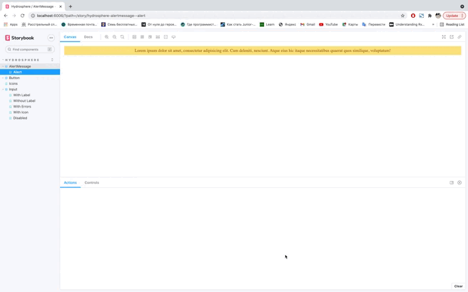

#  HydroServing Ui Kit

UI Kit for the Hydrosphere.io project, containing the common UI components and integrated with the Storybook.



## Getting Started

1. Run the following command:
```
  npm install hs-ui-kit
```

2. Import `HsUiKitModule` in your main module.

**app.module.ts**
```
  import { NgModule } from '@angular/core';
  import { BrowserModule } from '@angular/platform-browser';
  import { HsUiKitModule } from 'hs-ui-kit';
  import { AppRoutingModule } from './app-routing.module';
  import { AppComponent } from './app.component';

  @NgModule({
    declarations: [
      AppComponent,
    ],
    imports: [
      BrowserModule,
      AppRoutingModule,
      HsUiKitModule,
      // ...
    ],
    bootstrap: [AppComponent]
  })
  export class AppModule {
  }
```

3. To add icons to your project include `IconsRegistryService` to providers of main module and register icons you need in the constructor.

**app.module.ts**
```
  import { NgModule } from '@angular/core';
  import { BrowserModule } from '@angular/platform-browser';
  import { HsUiKitModule, IconsRegistryService, hsIconsIconSearch } from 'hs-ui-kit';
  import { AppRoutingModule } from './app-routing.module';
  import { AppComponent } from './app.component';

  @NgModule({
    declarations: [
      AppComponent,
    ],
    imports: [
      BrowserModule,
      AppRoutingModule,
      HsUiKitModule,
      // ...
    ],
    providers: [IconsRegistryService],
    bootstrap: [AppComponent]
  })
  export class AppModule {
    constructor(private iconRegistry: IconsRegistryService) {
      this.iconRegistry.registerIcons([hsIconsIconSearch]);
    }
  }
```

4. To start storybook run the following command in the root directory:

```
  npm run storybook
```

This will start a local webpack server on port 6006 and you can visit the generated storybook by going to http://localhost:6006/.
